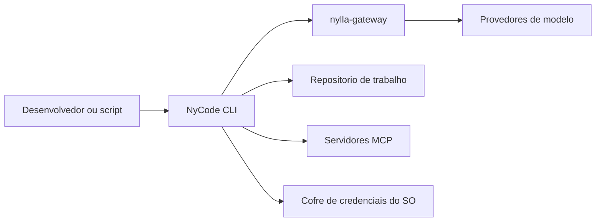
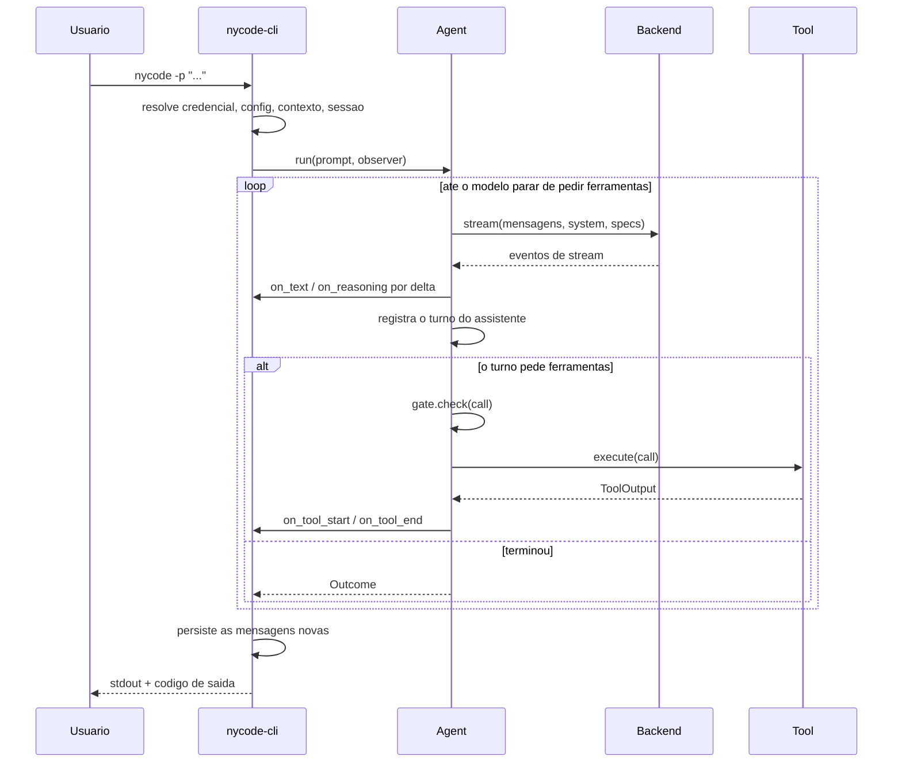

# Arquitetura — NyCode CLI

> Como o sistema é construído. O *porquê* de cada escolha significativa vive num
> [ADR](decisions/README.md); o *o quê* vive na
> [spec](../../.specs/nycode-rs/spec.md).

## 1. Introdução e objetivos

O NyCode CLI é um harness de coding agent em terminal, escrito em Rust, que já
vem apontado para um `nylla-gateway` self-hosted. Três objetivos de qualidade
dominam o desenho e são invariantes travados no CI, não aspirações:

| Objetivo | Orçamento | Medido |
|---|---:|---:|
| Startup, mediana de 20 execuções (NFR-1) | 100ms | 3ms |
| Memória residente de pico (NFR-2) | 30 MiB | 4,3 MiB |
| Binário auto-contido (NFR-3) | obrigatório | 8,6 MB, roda de qualquer diretório |

Um quarto objetivo é qualitativo e igualmente travado: **fidelidade de wire**
(NFR-4). Um erro in-band, um `stop_reason` fora do vocabulário ou um sinal de
usage estimado precisa chegar ao usuário como o gateway o emitiu, nunca
degradado em silêncio.

## 2. Restrições

- **Sem `unsafe`.** `unsafe_code = "forbid"` no workspace.
- **Sem pânico em caminho de produção.** `unwrap_used`, `expect_used`, `panic` e
  `todo` são `deny` de clippy. Um `unwrap` é uma decisão, não um atalho.
- **Sem runtime JavaScript embutido.** Medição no
  [ADR-0002](decisions/0002-extensions-are-out-of-process.md): V8 custaria +51 MB
  e apagaria o ganho que motiva o projeto.
- **Perfil de release agressivo.** LTO completo, uma unidade de codegen, `panic =
  "abort"` e símbolos removidos, para satisfazer NFR-3.
- Rust edition 2024, `rust-version` 1.96.

## 3. Contexto e escopo

O NyCode CLI é cliente: não hospeda inferência. O gateway expõe credenciais
próprias como API padrão OpenAI e Anthropic, e é o caminho recomendado.

## 4. Estratégia de solução

| Objetivo de qualidade | Abordagem |
|---|---|
| Startup e memória | Binário Rust estático; o runtime tokio só é construído quando há trabalho assíncrono, para que `--version` não pague por ele |
| Tamanho de binário | Extensibilidade out-of-process, sem interpretador embutido |
| Fidelidade de wire | Camada de dialeto que projeta cada wire num vocabulário comum de eventos, preservando o desconhecido em vez de descartá-lo |
| Segurança por padrão | Gate de permissão somente-leitura até que o operador diga o contrário |
| Corretude verificável | Harness diferencial contra a referência, mais os pisos de cobertura |

## 5. Blocos de construção

Seis crates num workspace cargo:

| Crate | Papel | Módulos principais |
|---|---|---|
| `nycode-ai` | Cliente de wire multi-dialeto | `anthropic/`, `openai/`, `transport/`, `catalog`, `dialect`, `event` |
| `nycode-agent` | Loop de agente | `agent`, `turn`, `tool`, `tools/`, `permission`, `session/`, `context/`, `mcp/` |
| `nycode-auth` | Resolução de credenciais | `resolver`, `subscription` (sob flag) |
| `nycode-tui` | Renderizador diferencial de terminal | `diff`, `terminal`, `width` |
| `nycode-cli` | Binário `nycode` | `main`, `observer` |
| `nycode-parity` | Harness diferencial contra a referência | `runner`, `transcript`, `workspace` |

A dependência flui numa direção só: `cli` → `agent` → `ai`, com `auth` e `tui`
consumidos pela `cli`. Nenhum crate de baixo nível conhece a CLI.

### Fronteiras que importam

- **`Backend`** é o trait que separa o loop de agente do cliente HTTP. É o que
  permite testar o agente inteiro contra um backend de mentira, sem rede.
- **`Observer`** é o trait que separa o loop de agente da apresentação. O loop
  emite eventos; quem decide se viram texto em stdout, pintura de terminal ou
  nada é o chamador.
- **`Gate`** é o trait que decide se uma chamada de ferramenta pode executar.
  Trocar política é trocar uma implementação, não editar o loop.
- **`Tool`** é o trait de uma ferramenta nativa. As quatro atuais (`read`,
  `write`, `edit`, `bash`) e as ferramentas MCP entram pela mesma porta.

## 6. Visão de runtime

Um turno headless, do prompt ao código de saída:

Três propriedades desse fluxo não são acidentais:

- **Os blocos `tool_use` voltam ao backend junto com os resultados.** Sem isso o
  turno seguinte referencia ids que o modelo não vê e o backend rejeita a
  conversa.
- **A sessão é persistida depois do turno,** nunca antes: gravar antes
  registraria uma conversa que não aconteceu se o backend recusasse o pedido.
- **Um erro de ferramenta volta como resultado de erro,** não como abort. Abortar
  desperdiçaria o turno inteiro; devolver deixa o modelo se corrigir. O limite de
  rodadas (`tool_limit`) é o que impede um modelo em laço de queimar cota.

## 7. Visão de implantação

Um binário estático, distribuído pelo workflow de release, sem runtime externo e
sem arquivos irmãos obrigatórios. Configuração por ambiente
(`NYCODE_BASE_URL`, `NYCODE_API_KEY`) ou por flag.

## 8. Conceitos transversais

- **Saída.** `stdout` carrega só a resposta, o que torna o binário utilizável num
  pipe; o progresso de ferramentas vai para `stderr`. Códigos de saída
  distinguem sucesso, recusa (3), estouro de limite (4), pausa (5) e motivo
  desconhecido (6), para que um script não precise parsear texto.
- **Permissões.** Somente-leitura por padrão; `--allow-writes` libera. O gate é
  consultado antes de a ferramenta tocar o disco, não depois.
- **Sessões.** JSONL append-only sob `.nycode/sessions`, com `--continue` e
  `--resume`. Sem sessão anterior, `--continue` começa uma nova em vez de falhar.
- **Contexto.** `AGENTS.md`, `CLAUDE.md`, `.claude/rules/` e `SKILL.md` são lidos
  sem configuração: as convenções que a organização já usa passam a valer.
- **Credenciais.** Cofre do sistema operacional, com variáveis de ambiente como
  alternativa. Nunca texto plano no repositório.
- **Erros.** Cada crate tem seu tipo de erro; nada é engolido em silêncio, o que
  é a face de NFR-4 no código.

## 9. Decisões

Ver o [índice de ADRs](decisions/README.md).

## 10. Requisitos de qualidade

NFR-1 a NFR-8 na [spec](../../.specs/nycode-rs/spec.md#requisitos-não-funcionais),
com os gates que os verificam tabelados em
[`docs/INDEX.md`](../INDEX.md#invariantes-travados-no-ci). Os dois pisos de
cobertura — 95% agregado e 90% por arquivo de produção — estão em
[ADR-0003](decisions/0003-pisos-de-cobertura-95-agregado-90-por-arquivo.md), e o
mesmo desenho de dois pisos governa performance em
[ADR-0012](decisions/0012-performance-e-medida-contra-um-concorrente-nomeado.md),
com a diferença de que ali o segundo piso é relativo a um concorrente medido.

Quando segurança e performance se opõem, a segurança define o que é aceitável e
a performance se acomoda ao que sobra — NFR-8, registrado no
[ADR-0011](decisions/0011-seguranca-antes-de-performance.md). No CI isso é
literal: o job `perf` declara `needs: [supply-chain]`.

## 11. Riscos e dívida técnica

- **FR-1 pendente.** A TUI interativa tem o renderizador diferencial pronto em
  `nycode-tui`, mas ainda não está ligada ao binário.
- **`subscription-oauth` é risco aceito e isolado.** O CI verifica que a crate
  `oauth2` não entrou transitivamente no build padrão
  ([ADR-0001](decisions/0001-subscription-oauth-is-a-flagged-accepted-risk.md)).
- **Caminho de falha do runtime não é exercitado.** A construção do runtime tokio
  só falha por exaustão de recursos do SO, o que não é reproduzível em teste.

## 12. Glossário

Ver [`docs/GLOSSARY.md`](../GLOSSARY.md) — linguagem ubíqua completa, mantida
num único lugar para não divergir daqui.
