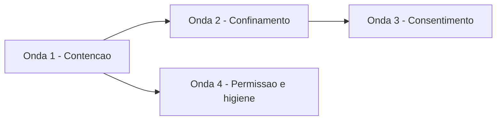

# plan — fronteira de confiança do agente

O COMO da [`spec.md`](spec.md). As decisões que custam caro reverter estão nos
ADRs [0016](../../architecture/decisions/0016-extensao-do-workspace-exige-consentimento.md)
e [0017](../../architecture/decisions/0017-duas-politicas-de-confinamento.md);
aqui fica a sequência e o que cada passo toca.

## Decisões de elicitação

Duas perguntas travavam o escopo. Ambas respondidas antes de escrever a spec.

**As sete divergências entre código e ADR aceito resolvem caso a caso.**
Segurança sobe até o ADR; funcionalidade desce até o código.

| Divergência | Destino |
|---|---|
| Confinamento de servidor MCP (ADR-0005) | Código sobe — com política própria, ver ADR-0017 |
| Confinamento de hook (ADR-0009) | Código sobe |
| Aviso de ausência de confinamento e nota na resposta (ADR-0005) | Código sobe |
| Falha de hook ruidosa (ADR-0009) | Código sobe |
| Kill-switch de assinatura (ADR-0001) | Código sobe |
| Fallback `landlock` e flag `--no-sandbox` (ADR-0005) | ADR desce — nunca construídos, e `bwrap` cobre o caso |
| Quatro eventos de hook (ADR-0009) | ADR desce — só `pre-tool-use` é disparado |

**O consentimento nega por omissão e degrada em modo headless.** Alinhado ao
`Approver::Never`, que já é o padrão de aprovação sem interlocutor, e ao
`connect_all`, que já degrada por servidor. O pipeline de CI e o
[`nycode-parity`](../../../crates/nycode-parity/src/runner.rs), que dirige o
binário com `--allow-writes` num subprocesso, seguem sem alteração — um prompt
travaria os dois.

## Restrição descoberta na elicitação

Envolver um servidor MCP em `sandbox::wrap` é mecanicamente trivial:
[`session.rs`](../../../crates/nycode-mcp/src/session.rs) já passa um
`tokio::process::Command` para `TokioChildProcess::new`, então a costura existe.
O problema é a política. A `workspace-write` inclui `--unshare-net`, e um
servidor MCP existe para falar com uma API. A consequência que a ADR-0005
declara não está apenas por implementar: ela é inaplicável na forma escrita.
Daí a segunda política do ADR-0017.

## Ondas

Quatro, com teste que falha primeiro em cada item e verificação por agente
separado de quem implementou. Achado crítico numa verificação trava a onda
seguinte.



### Onda 1 — Contenção

Sem arquitetura nova. São as correções que não dependem de decisão e que
destravam o resto.

- **FR-18** `env_clear()` mais allowlist explícita nos dois pontos de `spawn`.
  A allowlist mínima é `PATH`, `HOME`, `LANG` e `TERM`; o `env` declarado no
  arquivo entra por cima.
- **FR-9, FR-10** Contenção de link simbólico. `ToolContext::resolve` continua
  léxico para o caminho que ainda não existe — é o que permite `write` criar
  arquivo novo — e ganha, depois da normalização, a canonicalização do ancestral
  existente mais próximo e a reconferência da raiz. O mesmo helper cobre o
  carregamento de instrução, de skill e de comando. O teste
  `a_symlink_is_not_followed_out_of_the_root` em
  [`walk.rs`](../../../crates/nycode-agent/src/tools/search/walk.rs) é o modelo.
- **FR-8** Escape do caminho no perfil SBPL, ou recusa da raiz que ele não
  consegue representar.
- **FR-12** O filho nasce líder de grupo de processo; no prazo, o grupo e o
  líder recebem sinal e o chamador espera a colheita. `kill_on_drop` fica como
  última rede para o drop do future, não como mecanismo principal — matar só o
  wrapper `bwrap` deixou o processo no namespace escrevendo depois do corte.
- **FR-13** Inspeção do código de saída do hook.

### Onda 2 — Confinamento

Implementa o ADR-0017.

- `sandbox::wrap` passa a receber a política. Hoje há uma chamada só, no
  [`bash.rs`](../../../crates/nycode-agent/src/tools/bash.rs), o que torna a
  mudança de assinatura barata.
- **FR-5** Hook e servidor MCP stdio passam a ser envolvidos.
- **FR-6** A política de servidor MCP permite rede.
- **FR-7** O aviso passa a depender de `bash` ser alcançável pelo gate, e não de
  a sessão ser gravável — hoje a sessão interativa com gate `Ask` alcança `bash`
  e não avisa. A nota de ausência de confinamento é anexada ao resultado que
  chega ao modelo.
- **FR-8** O perfil do macOS troca `(allow default)` por negar por omissão, e a
  detecção do executável de confinamento deixa de confiar apenas na ordem do
  `PATH`.

### Onda 3 — Consentimento

Implementa o ADR-0016 e fecha o problema central da spec.

- **FR-4** Registro de consentimento no diretório de configuração do usuário,
  fora do workspace.
- **FR-1, FR-2** Chave por raiz canônica mais hash da declaração — o fragmento
  de configuração do servidor, o conteúdo do executável do hook. Hash diferente
  revalida.
- **FR-3** Pergunta em sessão interativa; em headless, nega e degrada com aviso.
- O consentimento roda antes de `attach_mcp` e antes de `Hooks::discover` ser
  entregue ao agente, em
  [`session.rs`](../../../crates/nycode-cli/src/session.rs).
- O comentário de
  [`mcp/tool.rs`](../../../crates/nycode-agent/src/mcp/tool.rs) que hoje afirma
  um isolamento de sistema operacional inexistente passa a descrever o que a
  onda 2 construiu.

### Onda 4 — Permissão e higiene

Independente das ondas 2 e 3.

- **FR-11** `--allow-writes` passa a conceder `write` e `edit`; um `--allow-all`
  separado concede o resto. O repositório ainda não tem release, então o custo
  de corrigir o contrato é zero — e só cresce daqui em diante.
- **FR-14** O hook passa a ser filtrado por nome de ferramenta antes da
  invocação, como a própria seção de revisão da ADR-0009 prevê, e os eventos que
  não disparam deixam de ser descobertos e anunciados.
- **FR-16** O kill-switch de assinatura é ligado ao caminho de autenticação.
- **FR-15** `Debug` manual redigindo o segredo nos três portadores, com teste
  afirmando que `{:?}` não o contém.
- **FR-17** `.nycode/` no `.gitignore` e artefato de sessão fora da árvore
  versionada.
- Itens de severidade baixa: validação de destino do servidor HTTP, credencial
  por entrada padrão em vez de argumento de linha de comando, cabeçalho de
  autenticação por dialeto em vez de ambos, shell sem `-l`, e os comentários que
  descrevem um escopo global que não existe.

## Verificação

Por onda, com a saída verificada e não presumida, na ordem do
[`AGENTS.md`](../../../AGENTS.md):

```bash
cargo fmt --all --check
cargo clippy --workspace --all-targets --all-features
cargo test --workspace --all-features
scripts/coverage-gate-test.sh
cargo llvm-cov --workspace --all-features --json --output-path coverage.json
scripts/coverage-gate.sh coverage.json
scripts/perf-gate.sh
```

Os pisos do NFR-5 valem e nenhuma exemption `below-floor` é aceitável para
passar. Código que não alcança o piso porque fixa uma dependência é problema de
desenho: a resposta é abrir costura, e este épico cria várias — a política de
confinamento como valor, o registro de consentimento como trait, o relógio e o
sistema de arquivos como parâmetro.
