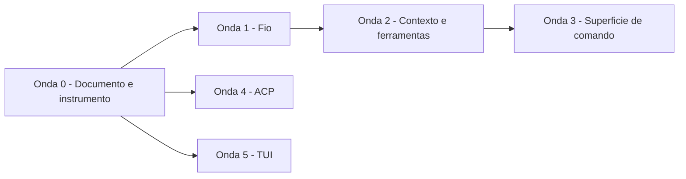

# plan — paridade com a referência e elevação a SOTA 2026

O COMO da [`spec.md`](spec.md). Este documento é também o registro ordenado do
épico: as ondas abaixo são as histórias, na ordem em que rodam, e o estado de
cada uma vive em [`traceability.md`](traceability.md).

## Decisões de elicitação

Duas perguntas travavam o escopo. Ambas respondidas antes de escrever a spec.

**A amplitude é o épico inteiro, em ondas, e não um recorte.** O inventário tem
sessenta deltas e não cabe numa entrega sob os gates deste repositório. A
alternativa considerada era corrigir só as assimetrias internas e reavaliar
depois; foi descartada porque deixaria o inventário fora do repositório, e um
levantamento que não vira documento versionado é refeito do zero na próxima vez
que alguém perguntar a mesma coisa.

**Das cinco emendas de escopo possíveis, só o ACP foi autorizado.** As outras
quatro — exportação OTLP, despacho paralelo, gestão de contexto no servidor do
provider, e suíte de avaliação como gate — ficam registradas na seção
[Adiado](#adiado-com-gatilho-de-reabertura) com o motivo e o gatilho que as
reabre. Registrar a recusa é o que impede que a mesma análise seja refeita.

## O inventário

Sessenta deltas entre este repositório e a referência no commit
`581d75a89cea21e50d6a26df840352f94427f633`, mais o que os dois deixam de fora
e 2026 pede. Cada um cai em um de quatro baldes.

### Balde A — assimetria interna

O que este repositório declara ter e não tem. É o balde mais caro por unidade de
esforço, porque cada linha aqui é uma afirmação falsa num documento aceito.

| # | Assimetria | Evidência | Requisito afetado |
|---|---|---|---|
| A1 | `Sampling` é inalcançável em produção: `with_sampling` e `with_thinking` não têm chamador fora de teste | [`sampling.rs`](../../../crates/nycode-ai/src/sampling.rs), [`transport/client.rs`](../../../crates/nycode-ai/src/transport/client.rs) | NFR-4 |
| A2 | Os dois dialetos OpenAI nunca consultam `sampling` ao montar o corpo; a única menção está em helper `#[cfg(test)]` | [`openai/chat.rs`](../../../crates/nycode-ai/src/openai/chat.rs), [`openai/responses.rs`](../../../crates/nycode-ai/src/openai/responses.rs) | NFR-4 |
| A3 | Cache de prompt só existe no dialeto Anthropic; o NFR-7 vale para um de três | [`anthropic/decorate.rs`](../../../crates/nycode-ai/src/anthropic/decorate.rs) | NFR-7 |
| A4 | A compactação só dispara no erro de contexto excedido, e retém contagem fixa de mensagens em vez de orçamento de tokens | [`agent/shrink.rs`](../../../crates/nycode-agent/src/agent/shrink.rs), [`session/compaction/mod.rs`](../../../crates/nycode-agent/src/session/compaction/mod.rs) | — |
| A5 | Não há preço em lugar nenhum; "custo visível" do FR-19 é contagem de tokens | [`catalog.rs`](../../../crates/nycode-ai/src/catalog.rs) | FR-19 |
| A6 | Não há transformação de mensagem antes do envio; trocar de modelo ou retomar ramo reenvia raciocínio assinado por outro modelo e chamada de ferramenta órfã | [`agent.rs`](../../../crates/nycode-agent/src/agent.rs) | FR-14, FR-19 |
| A7 | Contexto excedido é reconhecido por dois padrões de texto | [`error.rs`](../../../crates/nycode-ai/src/error.rs) | NFR-4 |
| A8 | A paridade nunca rodou contra a referência; o gate sai com zero sem gateway | [`parity-gate.sh`](../../../scripts/parity-gate.sh), [`README.md`](../../../README.md) | NFR-6 |

### Balde B — adotar da referência

Comportamento que a referência tem, que agrega, e que é adotado como está.

| # | Delta | Onda |
|---|---|---|
| B1 | Nível de raciocínio nomeado, com mapa por modelo e rebaixamento ao suportado mais próximo | 1 |
| B2 | Retry em duas camadas: transporte e política sobre a resposta, com allow-list de transitório e deny-list de limite de conta | 1 |
| B3 | `Retry-After` em formato HTTP-date | 1 |
| B4 | Saneamento de par substituto UTF-16 incompleto antes de serializar | 1 |
| B5 | Reparo em cascata do JSON parcial de argumento de ferramenta | 1 |
| B6 | Coerção de argumento de ferramenta contra o schema | 1 |
| B7 | Os dois casos de contexto excedido que o provider reporta sem erro | 1 |
| B8 | `tool_choice` no vocabulário canônico | 1 |
| B9 | Estimativa de contexto ancorada no último usage real, estimando só a cauda | 1 |
| B10 | Resumo de compactação com seções nomeadas | 2 |
| B11 | Marcador de compactação autocontido, carregando a cauda retida | 2 |
| B12 | Sumarização de ramo ao abandonar branch | 2 |
| B13 | Descarte de turno com parada de erro ou cancelamento antes do envio | 2 |
| B14 | Resultado sintético para chamada de ferramenta órfã | 2 |
| B15 | Degradação de imagem em modelo sem visão | 2 |
| B16 | Conversão de raciocínio cross-model em texto | 2 |
| B17 | `edit` com lista de substituições disjuntas | 2 |
| B18 | `bash` com prazo próprio e saída completa em arquivo | 2 |
| B19 | `read` devolvendo imagem | 2 |
| B20 | Teto de resultados em `grep`, `find` e `ls` | 2 |
| B21 | `terminate` no resultado de ferramenta | 2 |
| B22 | Separação entre direcionar e enfileirar para depois | 2 |
| B23 | Instruções de projeto dos diretórios ancestrais e do usuário, com arquivo de override | 2 |
| B24 | Campos completos da especificação Agent Skills, e skill não invocável pelo modelo | 2 |
| B25 | Restrição de ferramentas por nome na invocação | 3 |
| B26 | System prompt substituível e acrescentável, por arquivo e por flag | 3 |
| B27 | Sessão nomeada, com identificador escolhido, bifurcada na invocação e importada | 3 |
| B28 | Estatísticas de sessão, cópia da última resposta, nova sessão, recarga de recursos | 3 |
| B29 | Comando de shell do usuário no editor, com e sem envio ao modelo | 3 |
| B30 | Ambiente de sessão exposto ao shell, com opt-out | 3 |
| B31 | Sintaxe completa de argumento em prompt reutilizável | 3 |
| B32 | Autocomplete de comando, caminho e referência a arquivo | 5 |
| B33 | Localizador por correspondência aproximada | 5 |
| B34 | Marcador de colagem grande, anel de corte e desfazer | 5 |
| B35 | Atalhos remapeáveis por arquivo | 5 |
| B36 | Temas | 5 |
| B37 | Markdown com tabela, lista de tarefa e realce de sintaxe | 5 |
| B38 | Hiperlink, progresso na aba, cópia para área de transferência, marcadores de prompt | 5 |
| B39 | Imagem no terminal por protocolo gráfico | 5 |

### Balde C — adotar modificado

O que a referência resolve de um jeito que 2026 já superou, ou que este
repositório precisa resolver diferente.

| # | Delta | Como a referência faz | Como fica aqui | Onda |
|---|---|---|---|---|
| C1 | Cache de prompt fora do Anthropic | Chave de cache derivada de sessão, retenção longa, modo explícito | Mesmo mecanismo, com a chave derivada do identificador de sessão que a árvore já tem | 1 |
| C2 | Custo em moeda | Cálculo com faixas por tamanho de contexto e a regra de dobro para escrita de cache longa | Igual, com o preço vindo do catálogo descoberto — o FR-6 do produto proíbe hardcode | 1 |
| C3 | Catálogo de modelos | Gerado em build a partir de fonte comunitária, com manifesto e digest | Hidratação em runtime do catálogo já descoberto, complementada pela fonte comunitária que [`catalog.rs`](../../../crates/nycode-ai/src/catalog.rs) já declara e não usa | 1 |
| C4 | Gatilho de compactação | Limiar de ocupação com reserva e cauda em tokens | Igual, somado ao gatilho por erro que já existe — o erro continua sendo a rede de segurança | 2 |
| C5 | Integração com editor | Protocolo próprio em CBOR sobre socket local, que nada instancia dentro da própria referência | Agent Client Protocol, que é padrão externo com SDK em Rust | 4 |
| C6 | Confiança em servidor MCP | A referência não tem cliente MCP | O consentimento do [ADR-0016](../../architecture/decisions/0016-extensao-do-workspace-exige-consentimento.md) passa a fixar também a definição declarada, e não só a linha de comando | 2 |

### Balde D — recusar

Cada linha vira uma frase no não-escopo da [`spec.md`](spec.md), para que a
ausência não seja lida como esquecimento.

| # | Delta | Motivo |
|---|---|---|
| D1 | Gerenciador de pacotes e auto-atualização | Fora de escopo no produto; a distribuição de capacidades usa MCP |
| D2 | Runtime de extensão TypeScript | [ADR-0002](../../architecture/decisions/0002-extensions-are-out-of-process.md) |
| D3 | Exportação HTML e publicação de sessão | Superfície de apresentação fora do terminal |
| D4 | Renderização LaTeX e Mermaid | Idem |
| D5 | Pilha de sessão remota em CBOR | Código que nada instancia na própria referência; não-escopo do produto |
| D6 | Backend de sessão em SQLite | Idem: existe na referência e não é dependência do binário dela |
| D7 | Resposta diferida e API de lote | Contrato sem implementação real na referência |
| D8 | Provider local embutido | Fora de escopo: o alvo é o gateway |

## Ondas

Seis, com teste que falha primeiro em cada item. Achado crítico numa onda trava
a seguinte na mesma cadeia.



### Onda 0 — Documento e instrumento

Sem código de produção. Existe para que as cinco ondas seguintes tenham contra o
que medir.

- Esta spec, este plano e a matriz de rastreabilidade.
- O material bruto da pesquisa em [`sources/`](../../../sources/) e o RECON
  derivado em [`.specs/nycode-rs/`](../../../.specs/nycode-rs/).
- Emenda do não-escopo do produto, tirando de lá a integração de editor por
  protocolo padronizado.
- ADRs novos: nível de raciocínio, custo no catálogo, gatilho de compactação,
  fixação da definição MCP e ACP.
- **A paridade passa a rodar.** É o item que não pode escorregar: o NFR-6 é a
  regra que este épico inteiro serve, e hoje ela não tem instrumento.

### Onda 1 — O fio para de degradar em silêncio

Balde A1, A2, A3, A5, A7; balde B1 a B9; balde C1, C2, C3.

A ordem interna importa: `Sampling` alcançável (A1) precede os dialetos lendo
`sampling` (A2), que precede cache e raciocínio fora do Anthropic (A3, C1). O
custo (A5, C2) depende de o catálogo carregar preço (C3).

### Onda 2 — Contexto e ferramentas

Balde A4, A6; balde B10 a B24; balde C4, C6.

A transformação de mensagem (A6, B13 a B16) precede a compactação por limiar
(A4, C4): compactar um histórico que ainda contém chamada órfã produz um resumo
que descreve um estado que nunca existiu.

### Onda 3 — Superfície de comando

Balde B25 a B31. Depende da onda 2 porque quase toda flag nova liga a uma
capacidade que a onda 2 constrói.

### Onda 4 — Agent Client Protocol

Balde C5. Independente das ondas 1 a 3: consome o mesmo `Observer` que o sink de
eventos estruturados já usa, e portanto não espera nada delas.

### Onda 5 — TUI

Balde B32 a B39. Independente das demais.

## Adiado com gatilho de reabertura

Não entram nesta rodada. Cada um fica aqui com o motivo e com o que o reabre,
para que a decisão não precise ser reanalisada do zero.

| Item | Por que não agora | O que o reabre |
|---|---|---|
| Exportação OTLP e spans do loop | As convenções semânticas de IA generativa do OpenTelemetry seguem em desenvolvimento, mudaram de repositório em junho de 2026 e o novo ainda não tem release nem URL de schema. Adotar hoje é fixar um contrato que o autor ainda move | Primeira release versionada do repositório novo, com URL de schema estável. A ação padrão então é emitir mantendo modelo interno próprio e mapeando para as convenções só na exportação |
| Despacho paralelo com exclusão por caminho | O [ADR-0020](../../architecture/decisions/0020-o-despacho-de-ferramentas-e-sequencial.md) segue em vigor | O que o próprio ADR-0020 já declara como gatilho |
| Gestão de contexto no servidor do provider | Amarra o desenho da compactação a um provider específico antes de a compactação local estar correta. A onda 2 é pré-requisito, não alternativa | A compactação local fechada e medida, mais o mecanismo disponível em mais de um provider |
| Carga diferida de definição de ferramenta | Mesma razão: o ganho é proporcional ao número de ferramentas, e aqui são oito nativas | Contagem de ferramentas MCP típica passando de algumas dezenas |
| Suíte de avaliação como gate de CI | Um gate novo ao lado de cobertura, performance e paridade custa mais que o sinal que daria enquanto a paridade ainda não roda | A paridade rodando de fato e produzindo artefato — é o mesmo problema de instrumento, e resolvê-lo duas vezes em paralelo é desperdício |

## Verificação

Por onda, com a saída verificada e não presumida, na ordem do
[`AGENTS.md`](../../../AGENTS.md). Segurança antes de performance também aqui:

```bash
cargo fmt --all --check
cargo clippy --workspace --all-targets --all-features
cargo test --workspace --all-features
cargo deny check
scripts/coverage-gate-test.sh
cargo llvm-cov --workspace --all-features --json --output-path coverage.json
scripts/coverage-gate.sh coverage.json
cargo build --release
scripts/perf-gate-test.sh
scripts/perf-gate.sh
```

Os pisos do NFR-5 valem e nenhuma exemption `below-floor` é aceitável para
passar. O NFR-2 local acrescenta uma verificação que os gates não fazem: ao
fechar cada onda, todo símbolo público que ela introduziu precisa ter chamador
de produção. A assimetria A1 existe justamente porque essa verificação não
existia — o `with_sampling` tem teste, tem cobertura, e nunca foi chamado.
